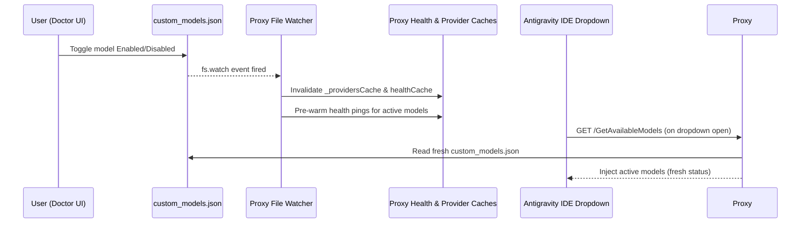

# Design Spec: Live Model Dropdown Synchronization in Antigravity Proxy

**Date:** 2026-08-01  
**Status:** Approved  
**Topic:** Real-time synchronization of model enable/disable toggles between Doctor UI and Antigravity IDE model dropdown.

---

## 1. Overview
When custom models or providers are enabled/disabled in the Doctor UI (or `custom_models.json`), Antigravity IDE requires immediate synchronization so the updated model list appears in the IDE model dropdown without restarting the IDE.

---

## 2. Architecture & Key Changes

### A. File Watcher & Instant Cache Invalidation (Option 1)
* **File Watcher (`src/proxy.ts` / `src/services/modelStore.ts`)**:
  * Implement an `fs.watch` on `~/.gemini/antigravity/custom_models.json`.
  * On change:
    1. Invalidate provider cache (`invalidateModelStoreCache()`).
    2. Clear model health check cache (`invalidateHealthCache()` in `modelHealthChecker.ts`).
    3. Trigger background health check pre-warm for newly enabled models.

### B. Fresh Reading & Unhealthy Model Injection Policy (Option 3)
* **Health Check Filtering (`src/proxy/protoInjector.ts`)**:
  * Modify `injectCustomModelsIntoResponse`:
    * If a model was just enabled and its health status is pending/undefined, DO NOT omit it. Inject it immediately with default status (`🟢`).
    * Only omit models if health status is explicitly verified as `unhealthy` with connection/auth error.

### C. Doctor UI Integration
* **Doctor UI Save (`ag-doctor-ui/src/main.ts`)**:
  * Touch or write to `custom_models.json` atomically, triggering the proxy's file watcher and invalidating caches in the main app process.

---

## 3. Data Flow

---

## 4. Verification Plan
1. **Automated Tests**:
   - Test `invalidateHealthCache()` in `modelHealthChecker.test.ts`.
   - Test `injectCustomModelsIntoResponse` includes newly enabled models with undefined health in `protoInjector.test.ts`.
   - Run `npm run lint && npm run build && npm test`.
2. **Manual Verification**:
   - Toggle model in Doctor UI -> Check Antigravity model dropdown -> Confirm model updates instantly without restarting IDE.
